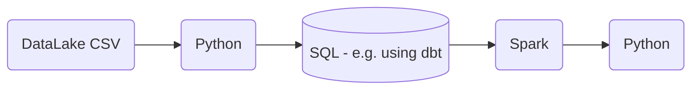
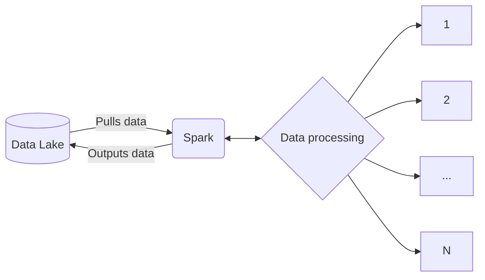

```toc
```
# Week 1 scratch notes

### useful links:
On container lifecycles: https://www.tutorialworks.com/why-containers-stop/#what-if-my-docker-container-dies-immediately

### full set of steps to get a running docker network and ingestion pipeline
1. docker compose up the pg and pgadmin containers
  - optional is to create a network and specify the network they need to run on
  - map the volumes, especially for the pg container to not lose data
2. docker build the ingestion script
3. call the ingestion script with the correct parameters

## Some useful docker commands
### how to login into the container with a bash prompt (container needs to already be running):
```shell 
docker exec -it pgsql-dev bash
```
### how to start a container with an image and bash into it:
```shell
docker run --interactive --tty --network=pg-network --entrypoint /bin/sh taxi_ingest:v001
```

### how to do a docker build:
```shell
docker build -t taxi_ingest:v001 .
```

### using a docker-compose:
#### final docker-compose used on the synology:
- note the use of tag 4.8 on the pgadmin image

```docker
version: "3.9"

networks:
  pg-network:
    external: true

services:
  pgdatabase:
    container_name: pgsql-dev
    image: postgres:13
    healthcheck:
      test: ["CMD", "pg_isready"]
      interval: 10s
      timeout: 45s
      retries: 10
      start_period: 30s
    volumes:
      - /volume1/docker/data:/var/lib/postgresql/data:rw
    environment:
      - POSTGRES_DB=nytaxi
      - POSTGRES_USER=root
      - POSTGRES_PASSWORD=root
    ports:
      - "5433:5432"
    restart: always
    networks:
      - pg-network

  pgadmin:
    container_name: pgadmin-dev
    image: dpage/pgadmin4:4.8
    volumes:
      - /volume1/docker/pgadmin:/var/lib/pgadmin
    environment:
      - PGADMIN_DEFAULT_EMAIL=admin@admin.com
      - PGADMIN_DEFAULT_PASSWORD=root
      - PGADMIN_LISTEN_ADDRESS=0.0.0.0
    ports:
      - 8080:80
    restart: always
    networks:
      - pg-network
    depends_on:
      - pgdatabase
```

#### examples:
```docker
version: "3.9"
services:
  pgsql-db:
    image: postgres:13
    networks:
      - bridge-network-u-know
    hostname: test-db
    healthcheck:
        test: ["CMD", "pg_isready", "-q", "-d", "data-data", "-U", "username"]
        timeout: 45s
        interval: 10s
        retries: 10
    user: 1044:100 #optional
    volumes:
      - /volume1/docker/your-data-folder:/var/lib/postgresql/data
    environment:
      POSTGRES_DB: data-data
      POSTGRES_USER: username
      POSTGRES_PASSWORD: password
    ports:
      - 192.168.2.137:12014:5432
    restart: always

networks:
  bridge-network-u-know:
    external: true 
```
```docker
version: "3.9"
services:
  pgsql-db:
    image: postgres:13
    hostname: test-db
    healthcheck:
        test: ["CMD", "pg_isready", "-q", "-d", "data-data", "-U", "username"]
        timeout: 45s
        interval: 10s
        retries: 10
    user: 1044:100 #optional
    volumes:
      - /volume1/docker/your-data-folder:/var/lib/postgresql/data
    environment:
      POSTGRES_DB: data-data
      POSTGRES_USER: username
      POSTGRES_PASSWORD: password
    ports:
      - 192.168.2.137:12014:5432
    restart: always
```

### for running outside of network
```shell
python ingest_taxi_data.py \
  --user=root \
  --password=root \
  --file_location="https://d37ci6vzurychx.cloudfront.net/trip-data/yellow_tripdata_2022-02.parquet" \
  --host_name=192.168.2.137 \
  --port=5433 \
  --table_name=yellowtaxidata \
  --database_name=nytaxi
```

### for running inside the virtual network
```shell
python ingest_taxi_data.py \
  --user=root \
  --password=root \
  --file_location="https://d37ci6vzurychx.cloudfront.net/trip-data/yellow_tripdata_2021-01.parquet" \
  --host_name=pgsql-dev \
  --port=5432 \
  --table_name=yellowtaxidata \
  --database_name=nytaxi
```

### Once the docker build is complete from above, you can rerun the above with this:
### Be sure to run it in the network
```shell
docker run -it \
  --network=pg-network \
  taxi_ingest:v001 \
    --user=root \
    --password=root \
    --file_location="https://d37ci6vzurychx.cloudfront.net/trip-data/green_tripdata_2019-01.parquet" \
    --host_name=pgsql-dev \
    --port=5432 \
    --table_name=greentaxidata \
    --database_name=nytaxi
```
```shell
docker run -it taxi_ingest:v001 \
    --user=root \
    --password=root \
    --file_location="https://d37ci6vzurychx.cloudfront.net/trip-data/yellow_tripdata_2022-02.parquet" \
    --host_name=localhost \
    --port=5433 \
    --table_name=yellowtaxidata \
    --database_name=nytaxi
```

## Week 2 scratch notes - Terraform and public cloud resource set up

### Getting Terraform and GCP working
- Terraform:
  - Need to download terraform: https://www.terraform.io/downloads
  - Or just use homebrew:
    - brew tap hashicorp/tap
    - brew install hashicorp/tap/terraform
  - Not that I had to install latest Xcode and Xcode tools for this to work
- GCP:
  - Install gcloud CLI: https://cloud.google.com/sdk/docs/install-sdk
  - Google cloud console: https://console.cloud.google.com/

### Steps to get project, resources and accounts set up in GCP:
- Set up a new project
- Create a new service account
  - Assign the user basic>viewer access
  - Create a new managed JSON key (JSON file will automatically download):
    - file name of key: dtc-de-367718-d447f0bbc32c.json
    - saved to ~/.gc/ 
- NB: Need to make sure the GCP SDK is installed (previous step)
- Make sure the google environment variable points to the auth key:
  - ``` export GOOGLE_APPLICATION_CREDENTIALS="/Users/waleed/.gc/dtc-de-367718-d447f0bbc32c.json" ```
  - refresh the token and verify the authentication using the SDK:
    - ``` gcloud auth application-default login ```
    - in case gcloud doesn't work, just use it from wherever the google-cloud-sdk folder is located (in my case, I put it in ~/development/)
- GCP should now be configured

- Next up, we'll need a data lake (GCS bucket) and a data warehouse (BQ):
- To do that, we'll need to grant our service account access to various services and IAM roles to those services
- This can be done by editing the service account user and adding the following IAM roles
  - Services:
    - Storage Admin
    - Storage Object Admin
    - BigQuery Admin and Viewer
- We then enable the iam and iamcredentials APIs for our project:
  - You can navigate to these by going to the google main dashboard and browsing the APIs
  - https://console.cloud.google.com/apis/library/iam.googleapis.com
  - https://console.cloud.google.com/apis/library/iamcredentials.googleapis.com

### Creating terraforms
- There's a lot to go through here, but the basics are:
  - There is a main.tf and a variables.tf (other options files exist too)
  - In main.tf is where you specific your resource provider (e.g. google) and the resources you want to deploy (e.g. gcs bucket, bq data warehouse, etc.)
  - In variables.tf is where you can specific resource specific variables that you don't want to clutter the main.tf with
    - This includes things like your project id, storage classes, regions, etc.

  - Once you have your terraform files ready to go, you need to run:
``` terraform
terraform init
terraform apply
terraform destroy
```
  - These do what they sound like

## Running a parallel process in Azure

# Week 2 notes

- Switched to using prefect instead of airflow
- prefect has primitives called tasks, flows, blocks, among others
- these are used as decorators around python functions to create dependencies between the functions

- flows contain tasks
- blocks can be thought of as plugins or templates
  - for example, you can use a sqlalchemy block to store credentials for a postgres connection and invoke it as an object?

- What is the relationship between flows, tasks, deployments and work queues?
  - a deployment is a server-side concept that encapsulates a flow
  - this allows the flow to be scheduled and triggered via an API
  - it is the deployment that knows where your code is and the parameters required for the flow to run

- The deployment can include metadata like tags
  - tags can be used in notifications, for example
  - to create a local deployment with code stored locally, you do this:
```shell
prefect deployment build <path_to_python.py>:<name_of_flow_entrypoint> -n "name of your flow"
```
- this creates a yaml file with a deployment configuration
- to run that deployment, you do this:
```shell
prefect deployment apply <deployment.yaml>
```
- this creates a deployment ready to be run
- to run it, you need to assign it to an agent and a work queue like this:
``` shell
prefect agent start --work-queue <"name of the work queue, usually this is set to default?">
```

# Week 3 Notes

- I didn't take much notes for the data warehouse section since most of it was just sql in bigquery and setting buckets

# Week 4 Notes
## dbt Structure and Concepts:
### Directory structure
- The directory structure of a dbt project looks like this:
```
- analyses        : 
- macros          : includes a macro_properties.yml
- models          :
  - staging       : models used to stage data, should have a schema.yml
  - core          : models used to serve data to BI, should have a schema.yml
- seeds           :
- snapshots       :
- tests           :
- dbt_project.yml :
- packages.yml    :
```

### Important files in a project:
dbt_project.yml

### Concepts:
#### Models
  - a dbt "model" is basically a unit of code that abstracts away the DDL/DML aspect of data modeling
  - you have a dbt model file: my_model.sql with syntax like this:
  ```sql
  {{
    config(materialized='table')
  }}
  ```
  - which compiles into SQL that looks like this:
  ```sql
  create table my_schema.my_model as (
    Select *
    from staging.source_table
    where record_state = 'ACTIVE'
  )
  ```
  - materialization strategies include common things like: table, view, incremental, ephemeral

#### Sources:
- The from clause above needs to have something to point to
- That is defined in a config file (yml)
- so for example, instead of writing ```select * from staging.fhvdata``` if you have a source defined in your ```schema.yml``` you would write ```select * from {{ source('staging','fhvdata') }}```

#### Seeds:
- These are best described as the raw data (in CSV format)
  - Often, these are dimension tables that update less often
- Allows you to operate on raw csv files (vs data in a dwh)

# Week 5 Notes - Batch processing

## Batch Processing

- There are 2 ways of processing data:
  - **Batch processing**: processing _chunks_ of data at _regular intervals_.
      * Example: processing taxi trips each month.
          ```mermaid
          graph LR;
              a[(taxi trips DB)]-->b(batch job)
              b-->a
          ```
  - **Streaming**: processing data _on the fly_.
      * Example: processing a taxi trip as soon as it's generated.
          ```mermaid
          graph LR;
              a{{User}}-. gets on taxi .->b{{taxi}}
              b-- ride start event -->c([data stream])
              c-->d(Processor)
              d-->e([data stream])
          ```
- Batch jobs are often processing data over different intervals:
  - Weekly
  - Daily
  - X Times per hour/day/etc
  - Every X hours/days/minutes/etc.
- Weekly/daily tend to be the most common
- Batch jobs are commonly processed using tools like Python, SQL, Spark, Flink
- Python scripts are versatile and be executed anywhere
- Batch processing jobs are usually called **workflows** and are _orchestrated_ or _scheduled_ using tools like Airflow or Prefect with a few steps in between. A common workflow would look like this:

- Advantages of batch processing using workflows:
  - Easy to manage (although that's debatable given how complex the toolchain has become!)
  - Retries - if you look at the prefect section, _retry_ functionality seems like a very important feature of their _task_ decorators
  - Scale - you can choose to scale different parts of the workflow separately
- Disadvantages:
  - Delays: the entire workflow needs to run before data for the data interval it is processing can be used
    - For most use cases that's just fine

## Intro to Spark
- Spark is a data processing engine that can be horizontally scaled

- Spark is multi-language and is written in Scala
- You can find wrappers for Python (pyspark), R (sparkr), etc.
- Spark can also be used for streaming (by looking at a stream of data into smaller batch jobs)
- Spark is most often used on data found in data lakes and for jobs that can't be easily expressed using SQL
  - For jobs expressed in SQL, there are many solutions (including SparkSQL)
  - We saw a very new approach in _week 3_ GCP by using BQ on external tables stored in GCS

### Installing Spark
- I'm going to try a couple of things here:
  1. I'm going to do what Alexey did in the video and install Spark on a Linux VM in GCP. I'm generally very nervous to use paid services in public cloud providers so I'll try this but then default to option 2, which is:
  2. Running this on a macbook pro I have in my house which I use as a docker context

1. Linux install
  - We'll be using OpenJDK java _(jdk v11.0.2)_ and the latest spark version
  - We'll need to make sure once we've downloaded and extracted all the relevant files, we set some environment variables:
  ```shell
  # export JAVA environment variables in a linux machine
  export JAVA_HOME="${HOME}/spark/jdk-11.0.2"
  export PATH="${JAVA_HOME}/bin:${PATH}"

  # export spark environment variables in a linux machine
  export SPARK_HOME="${HOME}/spark/spark-3.3.2-bin-hadoop3"
  export PATH="${SPARK_HOME}/bin:${PATH}"
  ```
2. MacOS install
  - Complete instructions from the class are in [macos.md](./week_5_batch_processing/setup/macos.md)
  - Main difference with linux install is that we install all the packages from homebrew vs directly using binaries
    - Important correction: you need to use `brew install java11` for openjdk 11
    - The default step `brew install java` installs version 19
    - From [here](https://spark.apache.org/docs/latest/), the following versions are supported on macos to run Spark 3.3.2:
      > Spark runs on Java 8/11/17, Scala 2.12/2.13, Python 3.7+ and R 3.5+
    - To install pyspark now, we need to pass some env vars again. The change made from the instructions is the version of the py4j like this:
      ```shell
      export PYTHONPATH="${SPARK_HOME}/python/lib/py4j-0.10.9.5-src.zip:$PYTHONPATH"
      ```
### Working with Spark / pySpark
- The anatomy of a Spark session looks like this in python:
```python
spark = SparkSession.builder \
    .master("local[*]") \
    .appName('test') \
    .getOrCreate() \
```
- `spark` is an object we create that inherits from the `SparkSession` class
- `SparkSession` is the class of the object that we instantiate. builder is the builder method.
- `master()` sets the Spark master URL to connect to. The local string means that Spark will run on a local cluster. [*] means that Spark will run with as many CPU cores as possible.
- `appName()` defines the name of our application/session. This will show in the Spark UI.
- `getOrCreate()` will create the session or recover the object if it was previously created.